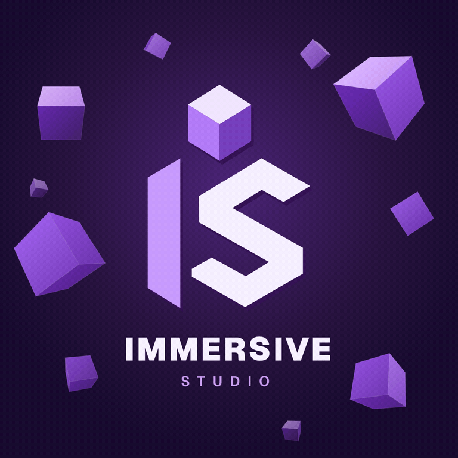
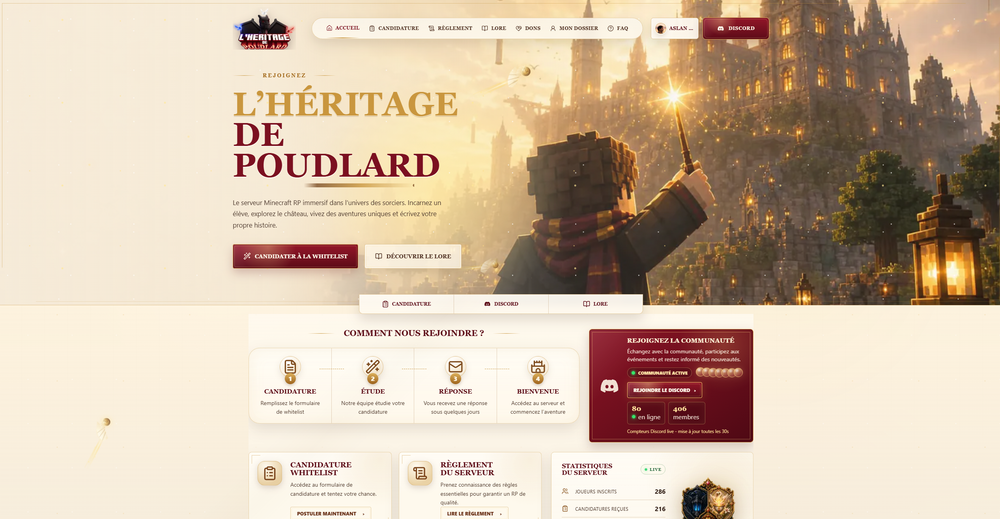
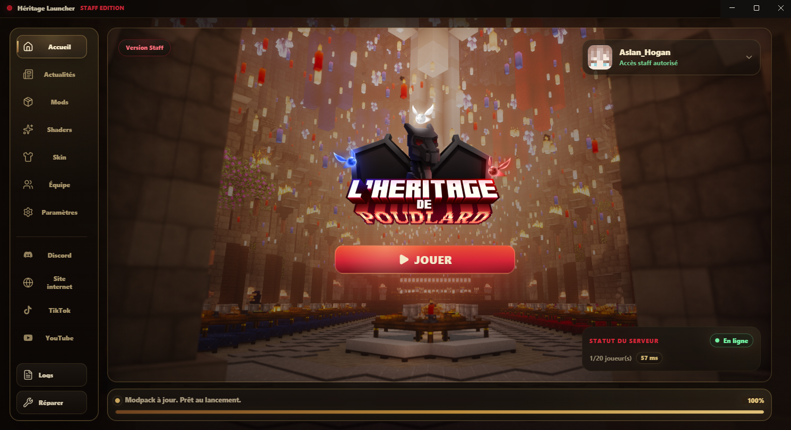
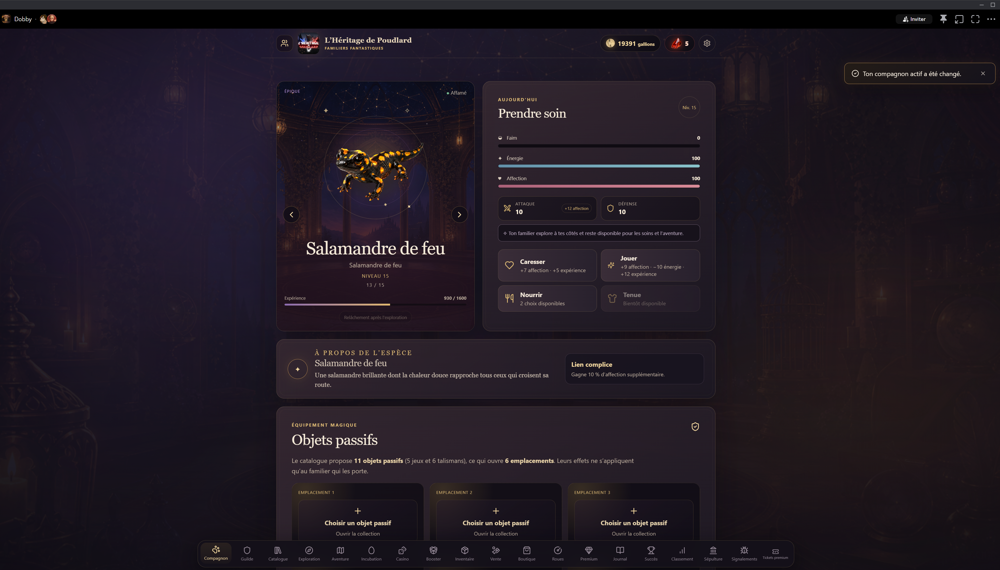

  

<h1 align="center">Aslan Hogan</h1>

  <strong>Chef de projet & développeur @ Immersive Studio</strong> 
  <em>Project Lead & Developer @ Immersive Studio</em>  
  Création d’expériences Minecraft, de plateformes web, de systèmes Discord et d’applications desktop. 
  Building Minecraft experiences, web platforms, Discord systems and desktop apps.

  
  
  

  <a href="#francais">🇫🇷 Français</a> · <a href="#english">🇬🇧 English</a>

---

## 🖼️ Réalisations mises en avant

<table>
  <tr>
    <td width="50%" align="center">
      
       <strong>Immersive Studio</strong> 
      Studio créatif et technique
    </td>
    <td width="50%" align="center">
      
       <strong>L’Héritage de Poudlard</strong> 
      Écosystème Minecraft RP
    </td>
  </tr>
  <tr>
    <td width="50%" align="center">
      
       <strong>Héritage Launcher</strong> 
      Launcher Windows & distribution du modpack
    </td>
    <td width="50%" align="center">
      
       <strong>Licaris</strong> 
      Launcher desktop pour expérience Cobblemon
    </td>
  </tr>
  <tr>
    <td width="50%" align="center">
      
       <strong>Familier Fantastique</strong> 
      Jeu Discord de compagnons et progression
    </td>
    <td width="50%" align="center">
      
       <strong>Créations Minecraft</strong> 
      Mods, modèles, gameplay, contenus et visuels
    </td>
  </tr>
</table>

---

## 🇫🇷 Français

### 👋 À propos

Je conçois et développe des expériences numériques immersives autour de projets Minecraft, web, Discord et desktop.

En tant que **chef de projet et développeur chez Immersive Studio**, j’interviens sur la conception produit, les spécifications, le développement, les tests, les déploiements, la gestion des versions et la coordination technique.

> Je n’imagine pas seulement des univers : je construis les systèmes qui permettent de les vivre.

### 🚀 Projets principaux

| Projet | Description | Mon rôle |
|---|---|---|
| **[Immersive Studio](https://immersive-studio.fr/)** | Studio créatif et technique regroupant plusieurs univers et projets immersifs. | Direction de projet, vision produit, organisation, présence web et coordination technique. |
| **[L’Héritage de Poudlard](https://heritagedepoudlard.fr/)** | Écosystème Minecraft RP français avec monde personnalisé, lore, site, portail joueur/staff, intégration Discord, launcher et modpack. | Créateur et responsable du projet ; conception des systèmes, spécifications, développement, infrastructure, tests et versions. |
| **[Héritage Launcher](https://github.com/Immersive-Studio-Corporation/heritage-launcher)** | Launcher Windows personnalisé avec authentification, gestion du modpack, skins, accès staff et outils de diffusion. | Conception produit, développement, tests, maintenance et gestion des versions. |
| **[Licaris](https://github.com/Immersive-Studio-Corporation/licaris)** | Launcher desktop orienté Cobblemon avec mises à jour automatiques, personnalisation joueur et ambiance visuelle dédiée. | Développement, design produit, tests, automatisation des releases et maintenance. |
| **Familier Fantastique** | Jeu de familiers sur Discord avec exploration, énergie, affection, inventaire, événements et progression. | Concept, gameplay, direction produit, infrastructure et coordination technique. |

### 🌌 Univers suivis / en développement

- Percy Jackson
- Teen Wolf
- Avatar
- Avengers
- The Last of Us
- Newgen

### 🧩 Ce que je développe

- Mods Minecraft Java sur plusieurs modloaders
- Plugins et outils serveur
- Launchers personnalisés et systèmes de mise à jour
- Modpacks, datapacks et resource packs
- Plateformes web, portails joueurs et panels d’administration
- Bots et systèmes Discord
- Applications desktop Windows
- API REST, services Docker et infrastructure Linux
- Modèles Blockbench, systèmes de gameplay et contenus visuels
- Documentation technique, tests et organisation produit

### 🛠️ Technologies et outils

**Minecraft, Java et systèmes de jeu**  
`Java` · `Minecraft Java Edition` · `Gradle` · `Fabric` · `Forge` · `NeoForge` · `Quilt` · `Mixins` · `Paper` · `Spigot` · `Bukkit` · `Modding Minecraft` · `Développement de plugins` · `Launchers personnalisés` · `Modpacks` · `Datapacks` · `Resource Packs`

**Construction, modèles et contenu**  
`Blockbench` · `Axiom` · `WorldEdit` · `Modèles personnalisés` · `Textures` · `Systèmes de gameplay` · `Outils serveur`

**Web et applications**  
`TypeScript` · `JavaScript` · `React` · `Vite` · `Node.js` · `Express` · `Fastify` · `Electron`

**Données et infrastructure**  
`PostgreSQL` · `Prisma` · `API REST` · `Docker` · `Linux` · `Caddy` · `Vercel`

**Intégrations et workflow**  
`Discord API / OAuth` · `Microsoft / Minecraft Authentication` · `Git` · `GitHub` · `GitHub Releases` · `Auto-update Systems` · `Python`

### 🌐 Liens

- **Immersive Studio :** [immersive-studio.fr](https://immersive-studio.fr/)
- **L’Héritage de Poudlard :** [heritagedepoudlard.fr](https://heritagedepoudlard.fr/)
- **Organisation GitHub :** [Immersive-Studio-Corporation](https://github.com/Immersive-Studio-Corporation)

---

## 🇬🇧 English

### 👋 About me

I design and build immersive digital experiences across Minecraft, web, Discord and desktop projects.

As **Project Lead & Developer at Immersive Studio**, I work on product direction, specifications, development, testing, deployment, release management and technical coordination.

> I do not just imagine universes — I build the systems that make them playable.

### 🚀 Featured projects

| Project | Description | My role |
|---|---|---|
| **[Immersive Studio](https://immersive-studio.fr/)** | A creative and technical hub bringing together multiple immersive universe projects. | Project leadership, product vision, organization, web presence and technical coordination. |
| **[L’Héritage de Poudlard](https://heritagedepoudlard.fr/)** | A French Minecraft RP ecosystem with a custom world, lore, website, player/staff portal, Discord integration, launcher and modpack. | Creator and project lead; systems design, specifications, development, infrastructure, testing and releases. |
| **[Héritage Launcher](https://github.com/Immersive-Studio-Corporation/heritage-launcher)** | A custom Windows launcher with authentication, modpack management, skins, staff access and delivery tools. | Product design, development, testing, maintenance and release management. |
| **[Licaris](https://github.com/Immersive-Studio-Corporation/licaris)** | A Cobblemon-oriented desktop launcher with automatic updates, player customization and a dedicated visual identity. | Development, product design, testing, release automation and maintenance. |
| **Familier Fantastique** | A Discord companion game with exploration, energy, affection, inventory, events and progression systems. | Concept, gameplay design, product direction, infrastructure and technical coordination. |

### 🌌 Universes explored / in development

- Percy Jackson
- Teen Wolf
- Avatar
- Avengers
- The Last of Us
- Newgen

### 🧩 What I build

- Minecraft Java mods across multiple mod loaders
- Plugins and server-side tools
- Custom launchers and update systems
- Modpacks, datapacks and resource packs
- Web platforms, player portals and admin panels
- Discord bots and connected systems
- Windows desktop applications
- REST APIs, Docker services and Linux infrastructure
- Blockbench models, gameplay systems and visual content
- Technical documentation, testing workflows and product organization

### 🛠️ Technologies & tools

**Minecraft, Java & game systems**  
`Java` · `Minecraft Java Edition` · `Gradle` · `Fabric` · `Forge` · `NeoForge` · `Quilt` · `Mixins` · `Paper` · `Spigot` · `Bukkit` · `Minecraft Modding` · `Plugin Development` · `Custom Launchers` · `Modpacks` · `Datapacks` · `Resource Packs`

**Worldbuilding, models & content**  
`Blockbench` · `Axiom` · `WorldEdit` · `Custom Models` · `Textures` · `Gameplay Systems` · `Server Tools`

**Web & applications**  
`TypeScript` · `JavaScript` · `React` · `Vite` · `Node.js` · `Express` · `Fastify` · `Electron`

**Data & infrastructure**  
`PostgreSQL` · `Prisma` · `REST APIs` · `Docker` · `Linux` · `Caddy` · `Vercel`

**Integrations & workflow**  
`Discord API / OAuth` · `Microsoft / Minecraft Authentication` · `Git` · `GitHub` · `GitHub Releases` · `Auto-update Systems` · `Python`

### 🌐 Links

- **Immersive Studio:** [immersive-studio.fr](https://immersive-studio.fr/)
- **L’Héritage de Poudlard:** [heritagedepoudlard.fr](https://heritagedepoudlard.fr/)
- **GitHub Organization:** [Immersive-Studio-Corporation](https://github.com/Immersive-Studio-Corporation)

---

  <strong>Construire des mondes immersifs, un système à la fois.</strong> 
  <em>Building immersive worlds, one system at a time.</em>

