

  

<h1 align="center">Aslan Hogan</h1>

  <strong>Chef de projet & développeur @ Immersive Studio</strong> 
  <em>Project Lead & Developer @ Immersive Studio</em>

  Minecraft · Java · Modding · Web · Discord · Desktop · Infrastructure

  
  
  

  <a href="#-français">🇫🇷 Français</a> · <a href="#-english">🇬🇧 English</a>

  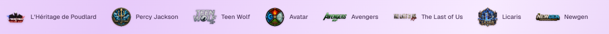

---

# 🇫🇷 Français

## 👋 À propos

Je suis **chef de projet et développeur chez Immersive Studio**, un studio centré sur la création d'expériences Minecraft, d'univers RP et d'outils techniques qui les accompagnent.

Je **co-dirige Immersive Studio avec Hugo Bertin**. Mon travail se concentre notamment sur la direction des projets, la conception des systèmes, le développement Minecraft, les launchers, les outils Discord, l'infrastructure, les tests et la mise en production.

> Je ne me contente pas d'imaginer des univers : je construis les systèmes qui permettent de les vivre.

> **Crédit web :** le site officiel **Immersive Studio** est principalement développé par **Hugo Bertin**. Je participe à sa direction produit, à la définition des projets et à la coordination du studio, mais je ne présente pas son développement web comme mon travail personnel.

---

## 🌌 Immersive Studio

  <a href="https://immersive-studio.fr/">
    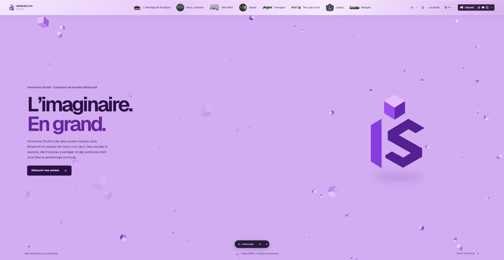
  </a>

**Immersive Studio** est le projet central autour duquel nous réunissons plusieurs expériences Minecraft et RP.

### Les univers

<table>
  <tr>
    <td width="50%" align="center">
      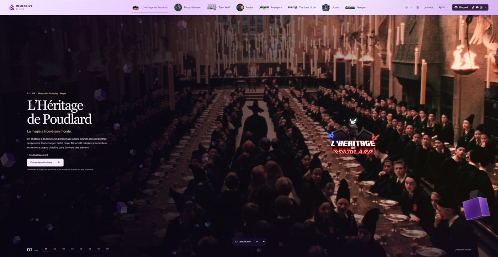 
      <strong>L’Héritage de Poudlard</strong> 
      Minecraft · Roleplay · Magie
    </td>
    <td width="50%" align="center">
      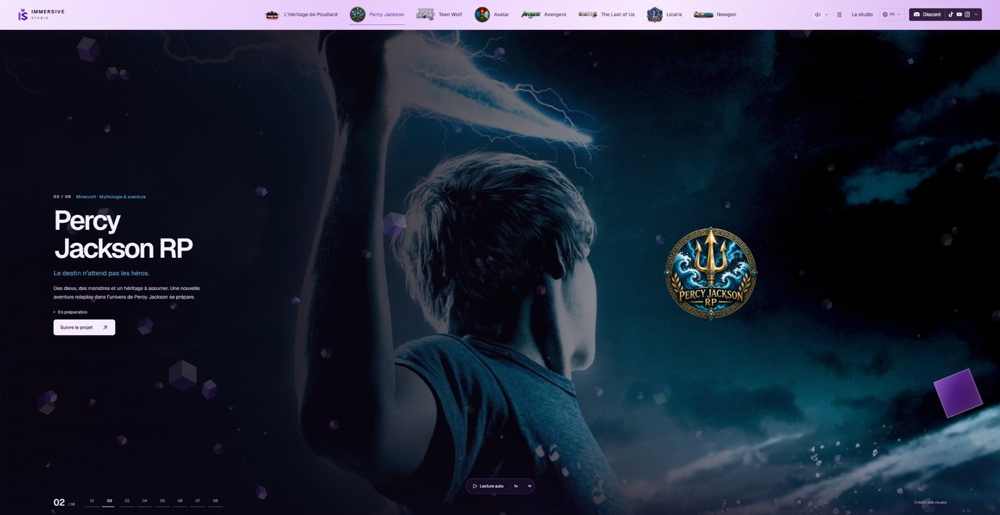 
      <strong>Percy Jackson RP</strong> 
      Minecraft · Mythologie · Aventure
    </td>
  </tr>
  <tr>
    <td width="50%" align="center">
      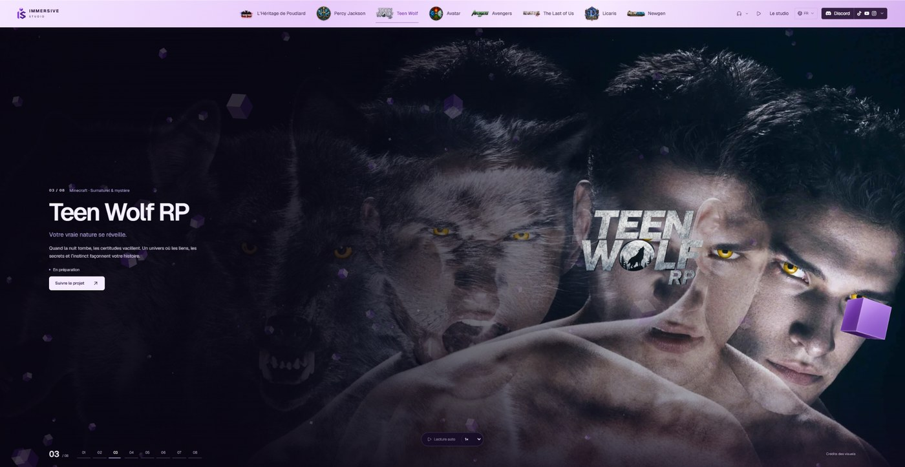 
      <strong>Teen Wolf RP</strong> 
      Minecraft · Surnaturel · Mystère
    </td>
    <td width="50%" align="center">
      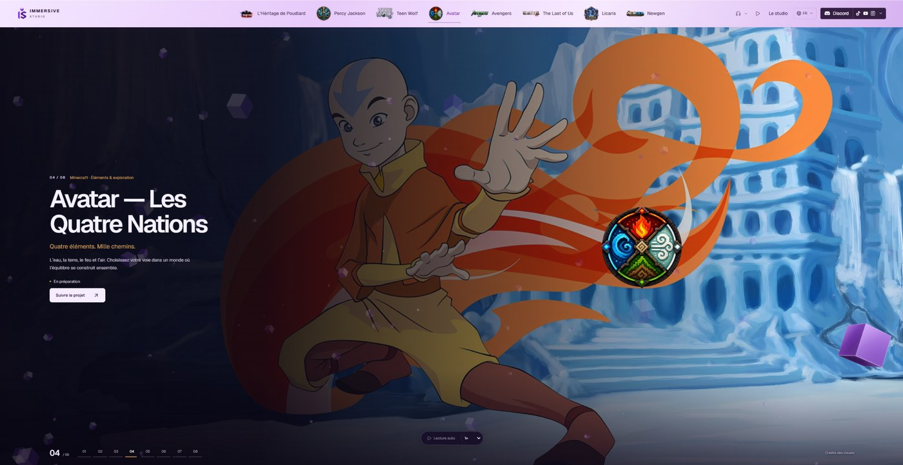 
      <strong>Avatar — Les Quatre Nations</strong> 
      Minecraft · Éléments · Exploration
    </td>
  </tr>
  <tr>
    <td width="50%" align="center">
      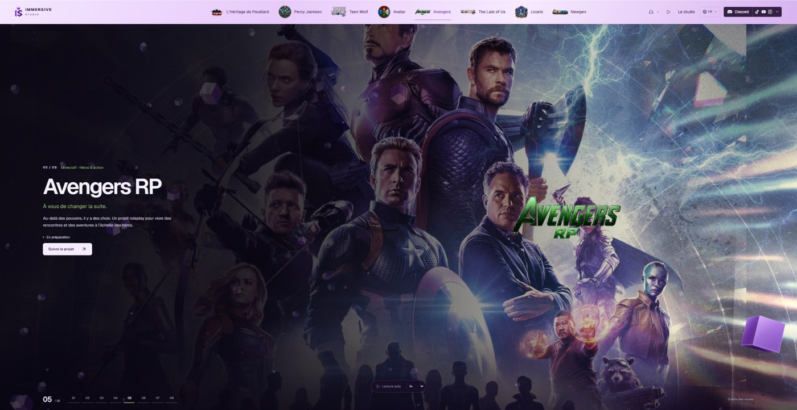 
      <strong>Avengers RP</strong> 
      Minecraft · Héros · Action
    </td>
    <td width="50%" align="center">
      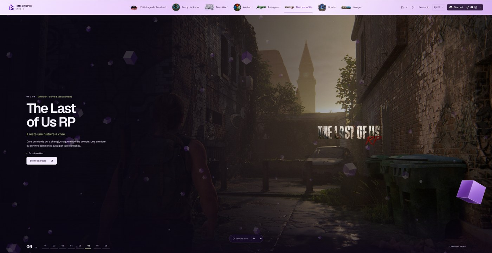 
      <strong>The Last of Us RP</strong> 
      Minecraft · Survie · Liens humains
    </td>
  </tr>
  <tr>
    <td width="50%" align="center">
      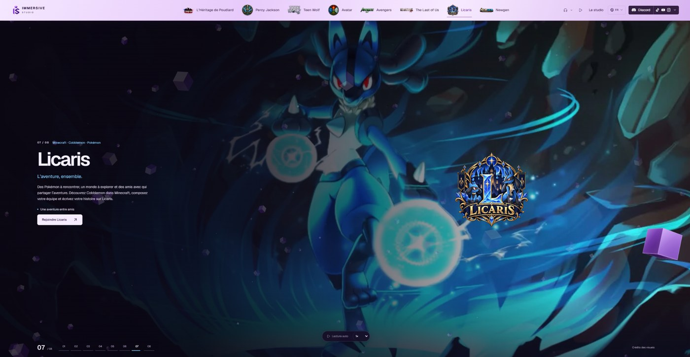 
      <strong>Licaris</strong> 
      Minecraft · Cobblemon · Pokémon
    </td>
    <td width="50%" align="center">
      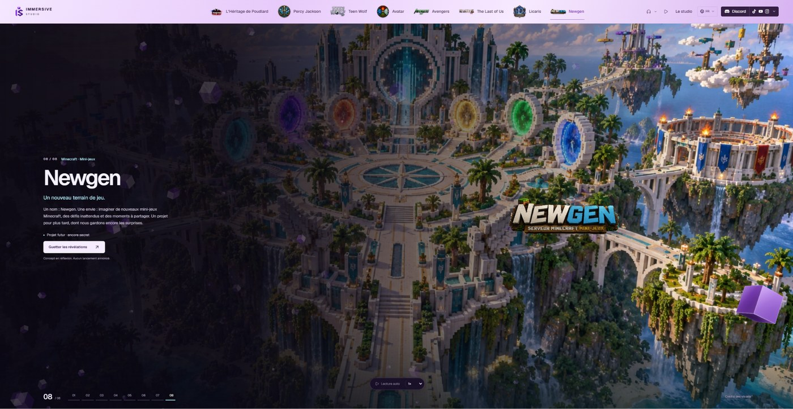 
      <strong>Newgen</strong> 
      Minecraft · Mini-jeux
    </td>
  </tr>
</table>

---

## 🧩 Ce que je construis

- Mods **Minecraft Java** sur plusieurs modloaders
- Plugins, outils serveur et systèmes de gameplay personnalisés
- Launchers Windows et chaînes de mise à jour
- Modpacks, datapacks et resource packs
- Systèmes Discord, Activities, bots et intégrations
- Applications desktop et interfaces de gestion
- API, services backend et bases de données
- Infrastructure Linux, Docker et services auto-hébergés
- Modèles Blockbench, contenus 3D, textures et éléments de gameplay
- Cahiers des charges, tests, releases et coordination technique

---

## 🖥️ Réalisations techniques

<table>
  <tr>
    <td width="50%" align="center">
       
      <strong>Héritage Launcher</strong> 
      Launcher Windows · Modpack · Accès joueurs/staff · Mises à jour
    </td>
    <td width="50%" align="center">
      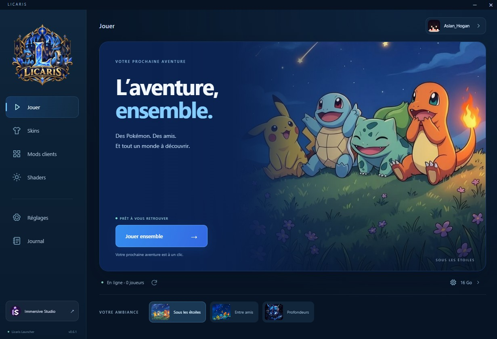 
      <strong>Licaris Launcher</strong> 
      Cobblemon · Mods clients · Shaders · Skins · Auto-update
    </td>
  </tr>
  <tr>
    <td width="50%" align="center">
      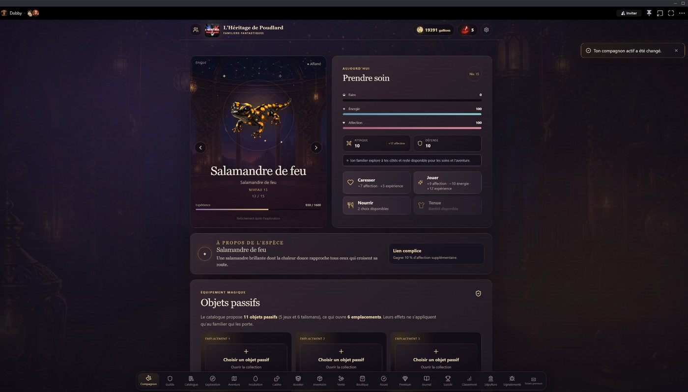 
      <strong>Familier Fantastique</strong> 
      Discord · Progression · Exploration · Inventaire · Événements
    </td>
    <td width="50%" align="center">
      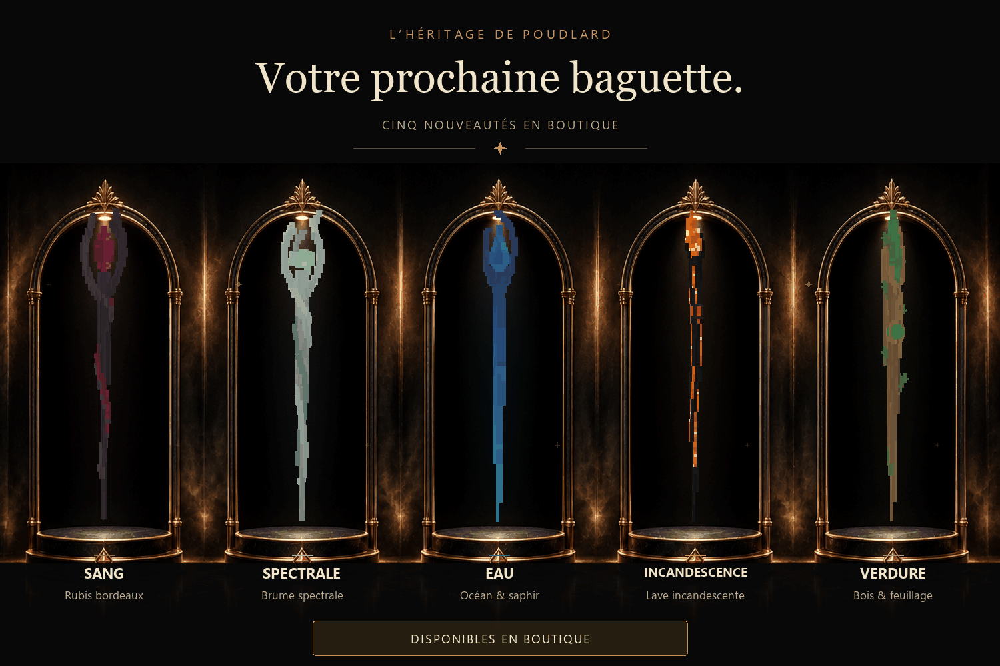 
      <strong>Contenus Minecraft</strong> 
      Baguettes · Modèles · Objets · Gameplay · Direction visuelle
    </td>
  </tr>
</table>

---

## 🚀 Projets principaux

| Projet | Ce que c'est | Mon rôle |
|---|---|---|
| **Immersive Studio** | Studio réunissant plusieurs expériences Minecraft et RP. | Co-direction, direction produit, conception des projets, coordination et développement technique. |
| **L’Héritage de Poudlard** | Écosystème Minecraft RP avec systèmes de jeu, launcher, modpack, Discord et infrastructure dédiée. | Créateur / Project Lead, conception des systèmes, développement Minecraft, outils, infrastructure et releases. |
| **Héritage Launcher** | Launcher Windows dédié au projet L’Héritage de Poudlard. | Conception, développement, tests, maintenance et diffusion. |
| **Licaris** | Expérience Cobblemon accompagnée de son launcher et de son modpack. | Développement du launcher, intégration modpack, tests, publication et maintenance. |
| **Familier Fantastique** | Jeu de familiers intégré à Discord. | Concept, systèmes de gameplay, direction produit, infrastructure et coordination technique. |

---

## 🛠️ Technologies & outils

### Minecraft, Java & systèmes de jeu

`Java` · `Minecraft Java Edition` · `Gradle` · `Fabric` · `Forge` · `NeoForge` · `Quilt` · `Mixins`

`Paper` · `Spigot` · `Bukkit` · `Minecraft Modding` · `Plugin Development`

`Custom Launchers` · `Modpacks` · `Datapacks` · `Resource Packs`

### Création & worldbuilding

`Blockbench` · `Axiom` · `WorldEdit` · `Custom Models` · `Textures` · `Gameplay Systems`

### Web & applications

`TypeScript` · `JavaScript` · `React` · `Vite` · `Node.js` · `Express` · `Fastify` · `Electron`

### Données & infrastructure

`PostgreSQL` · `Prisma` · `REST APIs` · `Docker` · `Linux` · `Caddy` · `Vercel`

### Intégrations & workflow

`Discord API / OAuth` · `Microsoft / Minecraft Authentication` · `Git` · `GitHub` · `GitHub Releases` · `Python`

---

## 🌐 Liens

- 🌍 **Immersive Studio :** [immersive-studio.fr](https://immersive-studio.fr/)
- 🪄 **L’Héritage de Poudlard :** [heritagedepoudlard.fr](https://heritagedepoudlard.fr/)
- 💻 **Organisation GitHub :** [Immersive-Studio-Corporation](https://github.com/Immersive-Studio-Corporation)

---

# 🇬🇧 English

## 👋 About me

I am a **Project Lead & Developer at Immersive Studio**, a studio focused on Minecraft experiences, roleplay universes and the technical systems supporting them.

I **co-lead Immersive Studio with Hugo Bertin**. My work focuses on project direction, systems design, Minecraft development, launchers, Discord tools, infrastructure, testing and releases.

> I do not just imagine universes — I build the systems that make them playable.

> **Web credit:** the official **Immersive Studio** website is primarily developed by **Hugo Bertin**. I contribute to product direction, project definition and studio coordination, but I do not present his web development work as my own.

---

## 🌌 Immersive Studio

  

**Immersive Studio** is the central project bringing together our Minecraft and roleplay experiences.

### Universes

<table>
  <tr>
    <td width="50%" align="center">
       
      <strong>L’Héritage de Poudlard</strong> 
      Minecraft · Roleplay · Magic
    </td>
    <td width="50%" align="center">
       
      <strong>Percy Jackson RP</strong> 
      Minecraft · Mythology · Adventure
    </td>
  </tr>
  <tr>
    <td width="50%" align="center">
       
      <strong>Teen Wolf RP</strong> 
      Minecraft · Supernatural · Mystery
    </td>
    <td width="50%" align="center">
       
      <strong>Avatar — The Four Nations</strong> 
      Minecraft · Elements · Exploration
    </td>
  </tr>
  <tr>
    <td width="50%" align="center">
       
      <strong>Avengers RP</strong> 
      Minecraft · Heroes · Action
    </td>
    <td width="50%" align="center">
       
      <strong>The Last of Us RP</strong> 
      Minecraft · Survival · Human connections
    </td>
  </tr>
  <tr>
    <td width="50%" align="center">
       
      <strong>Licaris</strong> 
      Minecraft · Cobblemon · Pokémon
    </td>
    <td width="50%" align="center">
       
      <strong>Newgen</strong> 
      Minecraft · Minigames
    </td>
  </tr>
</table>

---

## 🧩 What I build

- **Minecraft Java** mods across multiple mod loaders
- Plugins, server tools and custom gameplay systems
- Windows launchers and update pipelines
- Modpacks, datapacks and resource packs
- Discord systems, Activities, bots and integrations
- Desktop applications and management interfaces
- APIs, backend services and databases
- Linux infrastructure, Docker and self-hosted services
- Blockbench models, 3D content, textures and gameplay assets
- Specifications, testing, release workflows and technical coordination

---

## 🖥️ Technical work

<table>
  <tr>
    <td width="50%" align="center">
       
      <strong>Héritage Launcher</strong> 
      Windows launcher · Modpack · Player/staff access · Updates
    </td>
    <td width="50%" align="center">
       
      <strong>Licaris Launcher</strong> 
      Cobblemon · Client mods · Shaders · Skins · Auto-update
    </td>
  </tr>
  <tr>
    <td width="50%" align="center">
       
      <strong>Familier Fantastique</strong> 
      Discord · Progression · Exploration · Inventory · Events
    </td>
    <td width="50%" align="center">
       
      <strong>Minecraft Content</strong> 
      Wands · Models · Items · Gameplay · Visual direction
    </td>
  </tr>
</table>

---

## 🚀 Main projects

| Project | What it is | My role |
|---|---|---|
| **Immersive Studio** | Studio bringing together several Minecraft and roleplay experiences. | Co-leadership, product direction, project design, coordination and technical development. |
| **L’Héritage de Poudlard** | Minecraft RP ecosystem with gameplay systems, launcher, modpack, Discord and dedicated infrastructure. | Creator / Project Lead, systems design, Minecraft development, tooling, infrastructure and releases. |
| **Héritage Launcher** | Windows launcher dedicated to L’Héritage de Poudlard. | Design, development, testing, maintenance and delivery. |
| **Licaris** | Cobblemon experience with its own launcher and modpack. | Launcher development, modpack integration, testing, publishing and maintenance. |
| **Familier Fantastique** | Companion game integrated into Discord. | Concept, gameplay systems, product direction, infrastructure and technical coordination. |

---

## 🛠️ Technologies & tools

### Minecraft, Java & game systems

`Java` · `Minecraft Java Edition` · `Gradle` · `Fabric` · `Forge` · `NeoForge` · `Quilt` · `Mixins`

`Paper` · `Spigot` · `Bukkit` · `Minecraft Modding` · `Plugin Development`

`Custom Launchers` · `Modpacks` · `Datapacks` · `Resource Packs`

### Creation & worldbuilding

`Blockbench` · `Axiom` · `WorldEdit` · `Custom Models` · `Textures` · `Gameplay Systems`

### Web & applications

`TypeScript` · `JavaScript` · `React` · `Vite` · `Node.js` · `Express` · `Fastify` · `Electron`

### Data & infrastructure

`PostgreSQL` · `Prisma` · `REST APIs` · `Docker` · `Linux` · `Caddy` · `Vercel`

### Integrations & workflow

`Discord API / OAuth` · `Microsoft / Minecraft Authentication` · `Git` · `GitHub` · `GitHub Releases` · `Python`

---

## 🌐 Links

- 🌍 **Immersive Studio:** [immersive-studio.fr](https://immersive-studio.fr/)
- 🪄 **L’Héritage de Poudlard:** [heritagedepoudlard.fr](https://heritagedepoudlard.fr/)
- 💻 **GitHub Organization:** [Immersive-Studio-Corporation](https://github.com/Immersive-Studio-Corporation)

---

  <strong>Construire des mondes immersifs, un système à la fois.</strong> 
  <em>Building immersive worlds, one system at a time.</em>

